Regresión linear
================
Alejandro Czernikier
19/10/2024

Regresión Lineal

El objetivo general del trabajo es poder crear una serie de modelos
lineales para explicar y predecir el salario horario de las personas
según la información que proporciona la Encuesta Permanente de Hogares
de Argentina para el tercer trimestre del año 2023.

Se realizarán las siguientes tareas

Análisis exploratorios 1) Análisis estructura y correlación

Estructura y variables. Correlación entre variables numéricas.
Asociación de variables por sexo. ¿Cómo es la correlación entre la
variable a explicar (salario_horario) y el resto de las variables
numéricas?

Modelos Un modelo clásico del salario es la llamada ecuación de Mincer.
Existen varias especificaciones pero la más típica es:

E \[ln(salario)\] = β0 + β1AñosEducacion + β2ExperienciaLaboral +
β3ExperienciaLaboral2

La idea es ir acercandose a esa lógica de modelado

2)  Modelos lineales experiencia Se va a comenzar con dos modelos
    lineales que utilicen la información de la experiencia potencial. Se
    comenzará por ajustar un modelo de regresión para explicar el
    salario por hora usando únicamente la experiencia potencial como
    covariable.

E(SalarioHorario) = β0 + β1ExperienciaPotencial

Luego, se ajustará otro modelo en donde las únicas covariables sean la
experiencia potencial y el cuadrado de la experiencia potencial.

E(SalarioHorario) = β0 + β1ExperienciaP otencial +
β2ExperienciaPotencial2

Se contestarán estas preguntas en base a ambos modelos:

¿Cuál es el impacto de un año adicional de experiencia potencial en el
salario horario esperado para cada uno de estos modelos? ¿Cuál es el
efecto sobre el salario horario esperado de un año más de experiencia
laboral para una persona con 6 años de experiencia laboral? ¿Y para una
persona con 35 años de experiencia laboral?

3)  Modelo lineal múltiple Se planteará un primer modelo múltiple a
    partir de la ecuación de Mincer:

E(SalarioHorario) = β0 + β1AñosEducacion + β2ExperienciaP otencial +
β3ExperienciaP otencial2+ β4Sexo + β5Sexo · AñosEducacion

Se intentará responder estas preguntas: ¿Cuál es la interpretación de
los coeficientes incluidos en el modelo? ¿Son significativos? ¿El modelo
resulta significativo para explicar el salario? ¿Qué porcentaje de la
variabilidad explica el modelo?

Se analizará en profundidad el cumplimiento de los supuestos del modelo
lineal para este modelo

4)  Modelo de Mincer “enriquecido” Se procederá a modelar según una
    especicación del modelo de Mincer con ciertas variables adicionales

E \[ln(SalarioHorario)\] = β0 +β1AñosEducacion+β2ExperienciaP otencial
+β3ExperienciaP otencial2+ β4Sexo + β5Sexo · AñosEducacion

Se intentarán responder estas preguntas • ¿Cuál es la interpretación del
coeficiente asociado a la variable de años de educación? ¿Se observan
cambios en la significatividad individual de los coeficientes respecto
al modelo anterior?

• ¿Qué porcentaje de la variabilidad del salario horario explica el
modelo? ¿Cómo se compara con la variabilidad explicada por el modelo
anterior?

• Analizar en profundidad el cumplimiento de los supuestos del modelo
lineal para este modelo y comparar con el análisis del modelo anterior

5)  Modelos propios y evaluación

Se realizarán 2 modelos lineales múltiples adicionales

Se evaluará comparará la performance del modelo lineal multiple, el
modelo de mincer y los modelos desarrollados en este punto en el dataset
de entrenamiento y evaluación (dataset “eph_test_2023.csv”).

6)  Modelo lineal robusto

Se trabajará con el archivo “eph_train_outliers_2023.csv”. Este último
consiste en el dataset original de train con la incorporación de algunas
observaciones adicionales que pueden incluir valores atípicos.

Se realizarán dos gráficos del salario horario, uno para el dataset de
entrenamiento sin outliers y otro para el dataset con outliers que
permitan observar claramente la diferencia entre ambos sets de datos.

Sobre este nuevo conjunto de datos se entrenará el modelo lineal
multiple, el modelo de mincer y un modelo robusto. Se Comparará
exhaustivamente los coeficientes estimados y su significatividad entre
el modelo lineal multiple y el modelo robusto.

Se comparará la performance (RMSE y MAE) de los tres modelos entrenados
en este punto en el dataset de entrenamiento (con outliers) y de
evaluación.

``` r
# limpiamos la memoria
rm(list = ls()) # remove all objects
gc()            # garbage collection
```

    ##          used (Mb) gc trigger (Mb) max used (Mb)
    ## Ncells 487200 26.1    1048771 56.1   686457 36.7
    ## Vcells 915165  7.0    8388608 64.0  1876895 14.4

``` r
library(tidyverse)
```

    ## Warning: package 'ggplot2' was built under R version 4.4.2

    ## ── Attaching core tidyverse packages ──────────────────────── tidyverse 2.0.0 ──
    ## ✔ dplyr     1.1.4     ✔ readr     2.1.5
    ## ✔ forcats   1.0.0     ✔ stringr   1.5.1
    ## ✔ ggplot2   3.5.1     ✔ tibble    3.2.1
    ## ✔ lubridate 1.9.3     ✔ tidyr     1.3.1
    ## ✔ purrr     1.0.2     
    ## ── Conflicts ────────────────────────────────────────── tidyverse_conflicts() ──
    ## ✖ dplyr::filter() masks stats::filter()
    ## ✖ dplyr::lag()    masks stats::lag()
    ## ℹ Use the conflicted package (<http://conflicted.r-lib.org/>) to force all conflicts to become errors

``` r
library(broom)
library(openintro)
```

    ## Cargando paquete requerido: airports
    ## Cargando paquete requerido: cherryblossom
    ## Cargando paquete requerido: usdata

``` r
library(GGally)
```

    ## Registered S3 method overwritten by 'GGally':
    ##   method from   
    ##   +.gg   ggplot2
    ## 
    ## Adjuntando el paquete: 'GGally'
    ## 
    ## The following object is masked from 'package:openintro':
    ## 
    ##     tips

``` r
library(corrr)
library(knitr)
library(kableExtra)
```

    ## 
    ## Adjuntando el paquete: 'kableExtra'
    ## 
    ## The following object is masked from 'package:dplyr':
    ## 
    ##     group_rows

``` r
library(reshape2)
```

    ## 
    ## Adjuntando el paquete: 'reshape2'
    ## 
    ## The following object is masked from 'package:openintro':
    ## 
    ##     tips
    ## 
    ## The following object is masked from 'package:tidyr':
    ## 
    ##     smiths

# 0. Carga de datos

``` r
#Levantamos dataset
df <- read.csv("eph_train_2023.csv")
#View(df)
#glimpse(df)
#table(sapply(df,class))
```

El dataset cuenta con 11772 registros y 20 variables (10 categóricas y
10 numéricas). Las numéricas de interes son: edad, horas_trabajadas,
educación, experiencia_potencial, salario y salario_horario

# 1. Análisis exploratiorio

``` r
#Análisis de valores faltantes
exploratorio <- df %>% 
  gather(., key="variables", value = "valores") %>%
  group_by(variables) %>%
  summarise(valores_unicos = n_distinct(valores),
  porcentaje_faltantes = sum(is.na(valores))/nrow(df)*100) %>%
  arrange(desc(porcentaje_faltantes), valores_unicos)
            
exploratorio
```

    ## # A tibble: 20 × 3
    ##    variables             valores_unicos porcentaje_faltantes
    ##    <chr>                          <int>                <dbl>
    ##  1 asistencia_educacion               3              0.00849
    ##  2 ano4                               1              0      
    ##  3 trimestre                          1              0      
    ##  4 alfabetismo                        2              0      
    ##  5 cat_cantidad_empleos               2              0      
    ##  6 sexo                               2              0      
    ##  7 tipo_establecimiento               3              0      
    ##  8 categoria_ocupacion                4              0      
    ##  9 nivel_ed                           6              0      
    ## 10 region                             6              0      
    ## 11 educacion                         24              0      
    ## 12 aglomerado                        32              0      
    ## 13 edad                              71              0      
    ## 14 experiencia_potencial             74              0      
    ## 15 horas_trabajadas                 105              0      
    ## 16 codigo_actividad                 144              0      
    ## 17 salario                          538              0      
    ## 18 salario_horario                 1713              0      
    ## 19 fecha_nacimiento                7582              0      
    ## 20 codusu                          8737              0

La única variable con valores faltantes es asistencia_educación, con
porcentajes mínimos (1 Nan). Lo dropeo

``` r
#Ubicamos fila con valor faltante
df_na <- df %>%
  filter(if_any(everything(), is.na))
df_na
```

    ##                          codusu ano4 trimestre            region aglomerado
    ## 1 TQRMNOPSXHJMPQCDEIJAH00812758 2023         3 Gran Buenos Aires         33
    ##   fecha_nacimiento edad asistencia_educacion               nivel_ed
    ## 1       06/09/1985   37                 <NA> Secundaria\nIncompleta
    ##   tipo_establecimiento codigo_actividad  sexo categoria_ocupacion
    ## 1              Estatal             5601 Mujer   Obrero o empleado
    ##   cat_cantidad_empleos          alfabetismo salario horas_trabajadas educacion
    ## 1                unico Sabe leer y escribir   43000               20        13
    ##   experiencia_potencial salario_horario
    ## 1                    19           537.5

``` r
#Al ser solo uno, lo dropeo
df <- df %>%
  drop_na()
```

``` r
#Nos quedamos con variables de interes. Excluyo las colineales. P.ej: salario_horario fue calculado a partir de salario total y las horas trabajadas 

df_1 <- df %>%
  select(edad, sexo, educacion, experiencia_potencial, salario_horario) %>% 
  rename(exp_pot=experiencia_potencial,
         salario_h=salario_horario)
```

Boxplot univariado

``` r
# Convertir el dataset a formato largo para facilitar la creación del boxplot
df_long <- melt(df_1, id.vars = "sexo")

# Crear el boxplot
ggplot(df_long, aes(x = sexo, y = value, fill = sexo)) +
    geom_boxplot() +
    facet_wrap(~ variable, scales = "free") +
    theme_minimal() +
    labs(title = "Boxplot de variables separadas por sexo", x = "Sexo", y = "Valor") +
    theme(axis.text.x = element_text(angle = 45, hjust = 1))
```

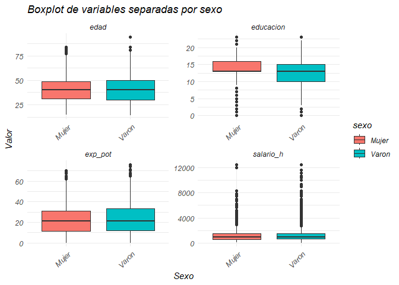<!-- -->

La variable salario horario presenta numerosos outliers, seguido por la
variable educación. Probé eliminando aquellos que superaban el 1er/3er
cuartil en 1.5 veces el rango intercuartílico y el ajuste no mejoró, por
lo cual decido dejar el dataset tal cual está.

Análisis de correlaciones

``` r
#Grafico con ggpairs
df_1 %>%
  ggpairs(aes(color=sexo), upper = list(continuous = wrap("cor", size = 3, hjust=0.8, alignPercent=0.75)), legend = 25) + 
  theme_bw() +
  theme(axis.text.x = element_text(angle=45, vjust=0.5), legend.position = "bottom")
```

    ## Warning in original_fn(size = 3, hjust = 0.8, alignPercent = 0.75, data =
    ## structure(list(: `alignPercent` is deprecated. Please use `align_percent` if
    ## alignment still needs to be adjusted

    ## Warning in original_fn(size = 3, hjust = 0.8, alignPercent = 0.75, data =
    ## structure(list(: `alignPercent` is deprecated. Please use `align_percent` if
    ## alignment still needs to be adjusted

    ## Warning in original_fn(size = 3, hjust = 0.8, alignPercent = 0.75, data =
    ## structure(list(: `alignPercent` is deprecated. Please use `align_percent` if
    ## alignment still needs to be adjusted

    ## `stat_bin()` using `bins = 30`. Pick better value with `binwidth`.
    ## `stat_bin()` using `bins = 30`. Pick better value with `binwidth`.

    ## Warning in original_fn(size = 3, hjust = 0.8, alignPercent = 0.75, data =
    ## structure(list(: `alignPercent` is deprecated. Please use `align_percent` if
    ## alignment still needs to be adjusted

    ## Warning in original_fn(size = 3, hjust = 0.8, alignPercent = 0.75, data =
    ## structure(list(: `alignPercent` is deprecated. Please use `align_percent` if
    ## alignment still needs to be adjusted

    ## `stat_bin()` using `bins = 30`. Pick better value with `binwidth`.

    ## Warning in original_fn(size = 3, hjust = 0.8, alignPercent = 0.75, data =
    ## structure(list(: `alignPercent` is deprecated. Please use `align_percent` if
    ## alignment still needs to be adjusted

    ## `stat_bin()` using `bins = 30`. Pick better value with `binwidth`.

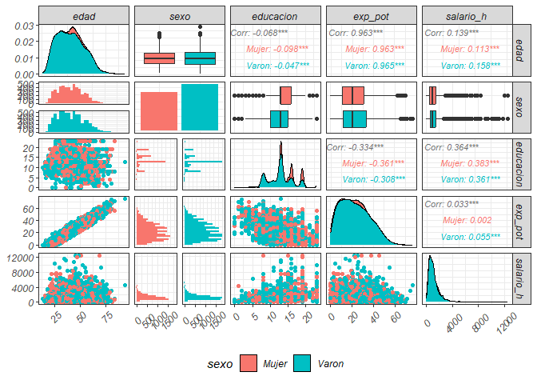<!-- -->

Dentro de las asociaciones de interés, se observan correlaciones
positivas del ingreso por hora con los años de educación, en menor
medida con la edad y mínima con la experiencia potencial. Llamativamente
se observa una asociacion negativa entre educación y edad, aunque muy
leve. Respecto a la apertura por sexo la correlación de salario_hora con
educación es ligeramente más fuerte en mujeres. Por su parte, la
asociación con experiencia solo es significativa en varones. Por último
el salario por hora de los varones correlaciona más fuertemente con la
edad que el de las mujeres

Matrices de correlacion

``` r
#Analizamos los coeficientes de correlación de Pearson y Spearman
#Pearson
matriz_tot <- df_1 %>%
  select_if(is.numeric) %>% 
  correlate(use = "complete.obs", method = "pearson") %>% 
  shave() %>% 
  fashion()
```

    ## Correlation computed with
    ## • Method: 'pearson'
    ## • Missing treated using: 'complete.obs'

``` r
matriz_tot
```

    ##        term edad educacion exp_pot salario_h
    ## 1      edad                                 
    ## 2 educacion -.07                            
    ## 3   exp_pot  .96      -.33                  
    ## 4 salario_h  .14       .36     .03

``` r
#Comparemos con matriz de Spearman, que es robusta y no requiere cumplimiento de normalidad
matriz_sp <-df_1 %>% 
  select_if(is.numeric) %>% 
  correlate(method = 'spearman') %>% 
  shave() %>% 
  fashion(decimals = 3)
```

    ## Correlation computed with
    ## • Method: 'spearman'
    ## • Missing treated using: 'pairwise.complete.obs'

``` r
matriz_sp
```

    ##        term  edad educacion exp_pot salario_h
    ## 1      edad                                  
    ## 2 educacion -.051                            
    ## 3   exp_pot  .965     -.292                  
    ## 4 salario_h  .156      .402    .049

Con ambos métodos obtenemos una correlación positiva moderada del
salario_horario con educación y baja con la edad y la experiencia. Los
años de educación parecieran ser un buen predictor para salario horario

# 2. Modelo lineal experiencia

$$
  \text{E(SalarioHorario) = β0 + β1 Experiencia Potencial} 
$$

``` r
# Creo modelo lineal de experiencia
modelo_exp = lm(formula = salario_h ~ exp_pot, data = df_1)
# Observamos que devuelve el modelo
modelo_exp
```

    ## 
    ## Call:
    ## lm(formula = salario_h ~ exp_pot, data = df_1)
    ## 
    ## Coefficients:
    ## (Intercept)      exp_pot  
    ##    1133.439        2.373

Análisis de coeficientes Intercept: salario por hora esperado para
alguien sin experiencia. exp_pot: por cada año de experiencia, el
salario por hora esperado aumenta a razón de 2.37 pesos. Es decir que el
impacto de un año más de experiencia será un aumeto de 2.37 pesos en el
salario por hora esperado. Esto es independiente de los años de
experiencia laboral que tenga (6 o 35)

``` r
#Graficamos modelo sobre datos observados

# Accedemos a la información de los coeficientes estimados
intercepto = modelo_exp$coefficients[1]
pendiente = modelo_exp$coefficients[2]

# Graficamos el dataset y el modelo
df_1 %>% ggplot(., aes(x = exp_pot, y = salario_h)) + 
  geom_abline(intercept = intercepto, slope = pendiente, color="steelblue", size=1.5) + # capa del modelo
  geom_point() + #capa de los datos
  theme_bw() +
  scale_x_continuous(limits = c(0,75)) +
  scale_y_continuous(limits = c(0,13000)) +
  labs(title="Modelo Lineal Simple: Años de experiencia", x="Años de experiencia", y="Salario Horario")
```

    ## Warning: Using `size` aesthetic for lines was deprecated in ggplot2 3.4.0.
    ## ℹ Please use `linewidth` instead.
    ## This warning is displayed once every 8 hours.
    ## Call `lifecycle::last_lifecycle_warnings()` to see where this warning was
    ## generated.

    ## Warning: Removed 1 row containing missing values or values outside the scale range
    ## (`geom_point()`).

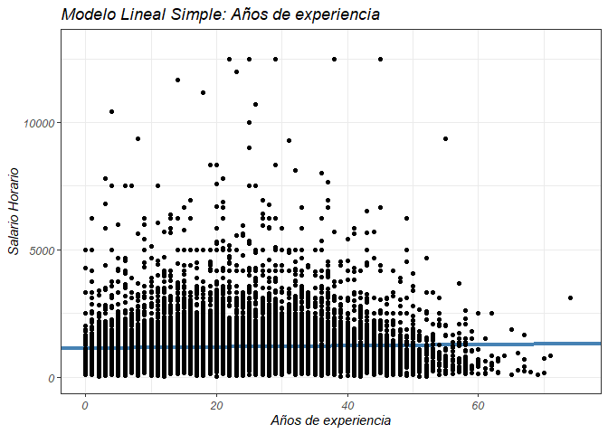<!-- -->

Se aprecia que el ajuste no es bueno y se percibe que a partir de
determinados años de experiencia el salario horario tiende a descender,
algo no capturado por el ajuste lineal con pendiente positiva.

Modelo cuadrático experiencia

$$
  \text{E(SalarioHorario) = β0 + β1 Experiencia Potencial + β2 Experiencia Potencial^2} 
$$

``` r
#Calculo el cuadrado de la experiencias
df_1$exp_pot_cuad <- df_1$exp_pot^2

modelo_exp_cuad = lm(formula = salario_h ~ exp_pot + exp_pot_cuad, data = df_1)
modelo_exp_cuad
```

    ## 
    ## Call:
    ## lm(formula = salario_h ~ exp_pot + exp_pot_cuad, data = df_1)
    ## 
    ## Coefficients:
    ##  (Intercept)       exp_pot  exp_pot_cuad  
    ##     913.5271       26.9755       -0.4862

Graficamos

``` r
# Crear un rango de valores para exp_pot
exp_pot_seq <- seq(min(df_1$exp_pot), max(df_1$exp_pot), length.out = 100)

# Calcular los valores predichos usando el modelo
predicciones <- 913.534 + 26.966 * exp_pot_seq - 0.486 * exp_pot_seq^2

# Crear un dataframe para las predicciones
df_predicciones <- data.frame(exp_pot = exp_pot_seq, salario_h = predicciones)

# Graficar los datos y el modelo cuadrático
ggplot(df_1, aes(x = exp_pot, y = salario_h)) +
  geom_point(aes(color = "Datos"), size = 2) +  # Datos originales
  geom_line(data = df_predicciones, aes(x = exp_pot, y = salario_h, color = "Modelo"), size = 1) +  # Línea del modelo
  labs(x = "Experiencia Potencial", y = "Salario Horario") +
  theme_bw() +
  scale_color_manual(values = c("Datos" = "blue", "Modelo" = "red")) +
  theme(legend.position = "bottom")
```

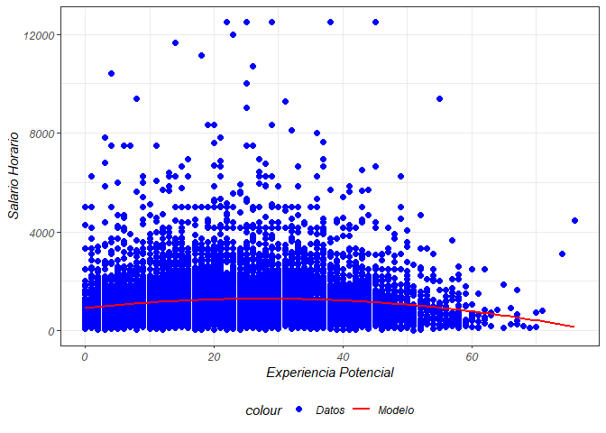<!-- -->

Dado que el coeficiente asociado al cuadrado de la experiencia potencial
es negativo, a determinada edad el salario_h esperado comienza a caer.
La tasa de cambio del salario horario se obtiene a partir de la derivada
en función de la experiencia potencial

$$
\frac{d(\text{salario_h})}{d(\text{exp_pot})} = 26.966 - 2 \cdot 0.486 \cdot \text{exp_pot} \quad[1]
$$

Donde es igual a cero, indica el valor de exp_pot donde el salario_h
esperado comienza a caer

$$
0 = 26.966 - 2 \cdot 0.486 \cdot \text{exp_pot}
$$

$$
  \text{exp_pot} ≈27.74
$$

A partir de los 28 años de experiencia, el salario por hora esperado
comienza a descender.

El impacto de un año más de experiencia dependerá de los años de
experiencia en que se lo esté analizado. Resolviendo \[1\] se obtiene
que el efecto sobre el salario horario esperado de un año más de
experiencia laboral para una persona con 6 años de experiencia laboral
es de 21.134 en tanto que para una personas con 35 años de experiencia
laboral el efecto es de -7.054. Es decir que un año de experiencia
adicional reduce el salario horario esperado en 7.054 pesos

# 3. Modelo múltiple: se plantea un primer modelo a partir de la ecuación de Mincer:

$$
  \text{E(SalarioHorario) = β0 + β1 Años Educacion + β2 Experiencia Potencial + β3 Experiencia Potencial^2+
β4 Sexo + β5 Sexo · Años Educación} 
$$

Al incluir la variable categórica sexo comenzaremos por evaluar
variación de salario horario por sexo

``` r
ggplot(data = df_1, aes(y = salario_h, group = sexo, fill = sexo)) +
         geom_boxplot() + 
         scale_fill_brewer(palette="Dark2") +
  theme_bw() +
  scale_y_continuous(limits = c(0, 12000)) +
  theme(axis.text.x=element_blank(),
        axis.ticks.x=element_blank()) +
         labs(title = "Boxplots de salario_horario según sexo") +
  labs(y = "Precio en pesos") +
  labs(x = "Sexo") +
  facet_wrap(~sexo)
```

    ## Warning: Removed 5 rows containing non-finite outside the scale range
    ## (`stat_boxplot()`).

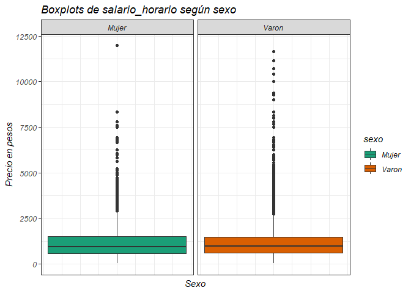<!-- -->

Analizando la variable sexo en función de la variable a predecir, no se
observan grandes diferencias en el salario por hora según el sexo. Los
varones parecieran presentar un salario por hora levemente mayor, con
mayor número de valores extremos. La dispersión es similar por sexo.

``` r
#Ajustamos el modelo planteado
modelo_mult <- lm(salario_h ~ educacion + exp_pot + exp_pot_cuad + sexo + sexo*educacion, data = df_1)
tidy_mult <- tidy(modelo_mult, conf.int = TRUE)
tidy_mult
```

    ## # A tibble: 6 × 7
    ##   term                estimate std.error statistic   p.value conf.low conf.high
    ##   <chr>                  <dbl>     <dbl>     <dbl>     <dbl>    <dbl>     <dbl>
    ## 1 (Intercept)         -834.      57.0       -14.6  5.12e- 48 -946.     -722.   
    ## 2 educacion            118.       3.57       33.1  2.06e-230  111.      125.   
    ## 3 exp_pot               24.0      2.07       11.6  7.94e- 31   19.9      28.1  
    ## 4 exp_pot_cuad          -0.227    0.0395     -5.75 9.08e-  9   -0.305    -0.150
    ## 5 sexoVaron            225.      63.6         3.54 4.00e-  4  101.      350.   
    ## 6 educacion:sexoVaron   -6.44     4.62       -1.40 1.63e-  1  -15.5       2.61

La primera aparición de la variable categórica es “Mujer” por lo tanto
esta es tomada como el valor de referencia.

Intercept (β0 = -834.19) El salario horario esperado para una mujer
cuando el resto de los regresores son cero, es decir sin años de
educación ni experiencia. Carece de sentido práctico pero al ser
significativamente distinto de cero (Ho) resulta importante para el
ajuste del modelo

Años de Educación (β1 = 118.39): Efecto principal de la educación en el
salario. Este coeficiente indica que, manteniendo constantes las demás
variables (es decir, dados los años de experiencia y el sexo), por cada
año adicional de educación, se espera que el salario horario aumente en
118.39 pesos. El p-valor extremandamente bajo implica la
significativaidad de esta variable para explicar el salario por hora
(tal como lo habíamos intuído en la matriz de correlaciones)

Dado que los coeficientes vinculados a la experiencia potencial son
cuadráticos deben interpretarse como en el caso anterior: basícamente el
salario aumenta a medida que se gana experiencia, pero a un ritmo
decreciente y en determinado momento el aumento en los años de
experiencia tiene un efecto negativo en el salario por hora. Aún así
ensayamos una interpretación de los coeficientes individuales:

Experiencia Potencial (β2 = 23.99): Componente lineal de la experiencia.
Este coeficiente sugiere que, dado el sexo y manteniendo las demás
variables constantes (algo imposible por el componente cuadratico), por
cada año adicional de experiencia potencial, el salario horario se
incrementa en aproximadamente 24 pesos. Es significativo para explicar
el salario horario.

Experiencia Potencial al Cuadrado (β3 = -0.227): Componente cuadrático
de la experiencia. Como es negativo, sugiere que, dado el sexo y los
años de educación, a medida que aumenta la experiencia, el efecto
incremental sobre el salario disminuye. Este término captura el efecto
no lineal de la experiencia, mostrando que, tras cierto punto, los
incrementos en la experiencia potencial tienen un efecto decreciente
sobre el salario. Es significativo para explicar el salario por hora.

SexoVaron (β4 = 225.22) Efecto principal del sexo: la diferencia en la
media de salario por hora de varones respecto a mujeres cuando el resto
de los regresores son constantes. Es decir, cuanto más cobra por hora un
varón respecto a una mujer, dados los años de educación y experiencia.
Sin embargo, este efecto puede estar modificado por la interacción con
la educación. Aun así esta variable categórica es significativa para
explicar el salario por hora.

Interacción SexoVaron · Años de Educación (β5 = -6.44): Este coeficiente
indica cómo el efecto de la educación en el salario varía dependiendo
del sexo, dados los años de experiencia. En este caso, por cada año
adicional de educación, el salario de los varones aumenta 6.44 pesos
menos que el de las mujeres, lo que significa que el efecto de la
educación es ligeramente menor para los varones. Ahora bien, dado que el
coeficiente no es estadísticamente significativo (p-valor = 0.162), no
hay suficiente evidencia para afirmar que el efecto de la educación sea
diferente entre varones y mujeres en este modelo, dados los años de
experiencia.

En resumen, la educación y la experiencia son predictores significativos
postivos del salario por hora. El sexo también tiene un efecto
considerable (los varones tienen un salario significativamente más alto
que las mujeres en promedio). Por último la interacción entre sexo y
educación no pareciera ser relevante, es decir el efecto de la educación
en el salario no depende del sexo en este modelo.

Análisis significatividad global

``` r
summary(modelo_mult)
```

    ## 
    ## Call:
    ## lm(formula = salario_h ~ educacion + exp_pot + exp_pot_cuad + 
    ##     sexo + sexo * educacion, data = df_1)
    ## 
    ## Residuals:
    ##     Min      1Q  Median      3Q     Max 
    ## -2360.6  -498.1  -161.4   276.2 11803.4 
    ## 
    ## Coefficients:
    ##                       Estimate Std. Error t value Pr(>|t|)    
    ## (Intercept)         -834.18886   57.03824 -14.625  < 2e-16 ***
    ## educacion            118.39361    3.57182  33.147  < 2e-16 ***
    ## exp_pot               23.99595    2.07277  11.577  < 2e-16 ***
    ## exp_pot_cuad          -0.22731    0.03952  -5.751 9.08e-09 ***
    ## sexoVaron            225.22461   63.60507   3.541   0.0004 ***
    ## educacion:sexoVaron   -6.44252    4.61741  -1.395   0.1630    
    ## ---
    ## Signif. codes:  0 '***' 0.001 '**' 0.01 '*' 0.05 '.' 0.1 ' ' 1
    ## 
    ## Residual standard error: 886.6 on 11765 degrees of freedom
    ## Multiple R-squared:  0.1671, Adjusted R-squared:  0.1668 
    ## F-statistic: 472.1 on 5 and 11765 DF,  p-value: < 2.2e-16

Analizando el test de significatividad global F que plantea:

$$
  \text{H}_0: \, \beta_1 = \beta_2 = \cdots = \beta_{p-1} = 0 \\
  \text{H}_1: \, \text{no todos los } \beta_k \, (k=1, 2, \dots, p-1) \, \text{son iguales a 0}
$$

Dado que el p-valor es \< 2.2e-16 confirmamos que al menos una variable
regresora sirve para explicar el salario horario, es decir el modelo es
globalmente significativo. Por su parte R-cuadrado/R-cuadrado ajustado
~0.167 significa que el modelo explica el aproximadamente 16.7% de la
variabilidad en el salario horario

Graficamos abriendo por sexo

``` r
# Crear un rango de valores para exp_pot
exp_pot_seq <- seq(min(df_1$exp_pot), max(df_1$exp_pot), length.out = 100)
educacion_promedio <- mean(df_1$educacion)  # Usamos la media de educación como referencia

# Crear predicciones separadas por sexo
predicciones_mujer <- predict(modelo_mult, 
                              newdata = data.frame(exp_pot = exp_pot_seq, 
                                                   exp_pot_cuad = exp_pot_seq^2,
                                                   educacion = educacion_promedio, 
                                                   sexo = "Mujer"))
predicciones_varon <- predict(modelo_mult, 
                              newdata = data.frame(exp_pot = exp_pot_seq, 
                                                   exp_pot_cuad = exp_pot_seq^2,
                                                   educacion = educacion_promedio, 
                                                   sexo = "Varon"))

# Crear un dataframe para las predicciones
df_predicciones <- data.frame(exp_pot = rep(exp_pot_seq, 2),
                              salario_h = c(predicciones_mujer, predicciones_varon),
                              sexo = rep(c("Mujer", "Varon"), each = length(exp_pot_seq)))

# Graficar los datos y las predicciones por sexo
ggplot() +
  geom_point(data = df_1, aes(x = exp_pot, y = salario_h), color = "grey", size = 2) +  # Datos originales en gris
  geom_line(data = df_predicciones, aes(x = exp_pot, y = salario_h, color = sexo), size = 1) +  # Línea del modelo por sexo
  labs(x = "Experiencia Potencial", y = "Salario Horario", color = "Sexo") +
  theme_bw() +
  scale_color_manual(values = c("Mujer" = "blue", "Varon" = "red")) +
  theme(legend.position = "bottom")
```

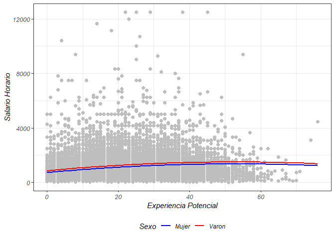<!-- -->

Cumplimiento supuestos

``` r
plot(modelo_mult)
```

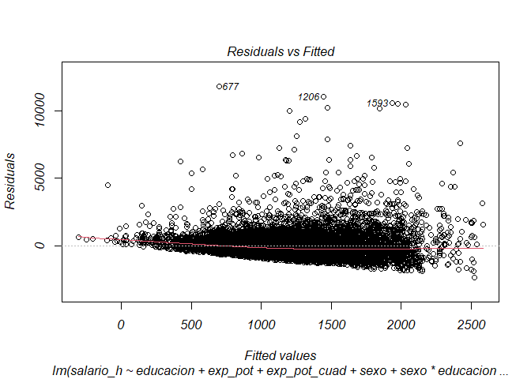<!-- -->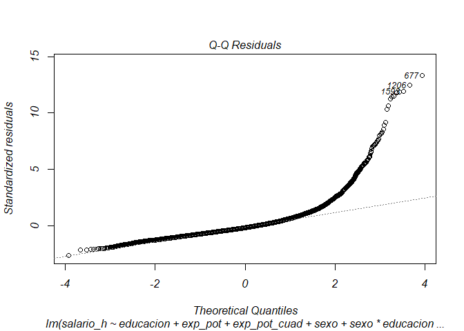<!-- -->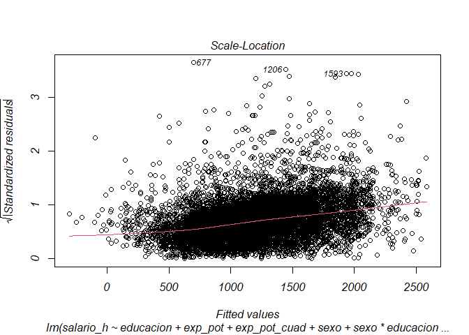<!-- -->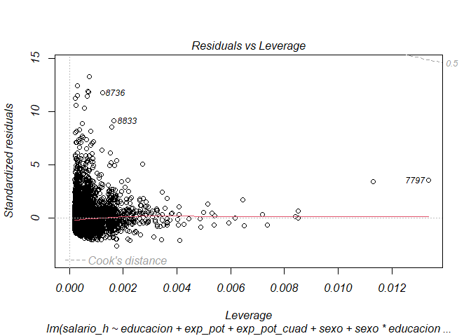<!-- -->

Residuos vs valores predichos: Se observa cierta estructura de “embudo”
con una mayor dispersión de los residuos a medida que aumentan los
predichos. Sugiere que hay una parte sistemática del fenómeno que se
esta perdiendo. La mayoría de los residuos son positivos, indicando que
la mayoría de los datos están por encima de los predichos.

Normal QQ plot: Gran parte de los residuos estandarizados no se ajustan
a la curva teórica ~N(0,1), sobretodo los del extremo superior.

Scale-location plot: Se observa estructura en los datos, con la raíz de
los residuos estandarizados aumentando a medida que crece los predichos.

Residual vs leverage: Ningun punto por encima de la línea de Cook, que
indica mediciones muy influyentes. La mayoría de los puntos se
encuentran cerca de la línea horizontal en el eje Y, lo que sugiere que
la mayoría de las observaciones tienen residuos relativamente pequeños y
no son influyentes. Si hay puntos con alto Leverage(7797) y alto
residuos (8736 y 8833) sugiriendo su influencia en el modelo.

``` r
df_1[c(7797,8736,8833),]
```

    ##      edad  sexo educacion exp_pot salario_h exp_pot_cuad
    ## 7797   94 Varon        13      76  4464.286         5776
    ## 8736   69 Mujer        19      45 12500.000         2025
    ## 8833   71 Varon        11      55  9375.000         3025

``` r
# Calcular las medias solo para columnas numéricas en df_1
medias_numericas <- colMeans(df_1[sapply(df_1, is.numeric)], na.rm = TRUE)

# Mostrar los resultados
print(medias_numericas)
```

    ##         edad    educacion      exp_pot    salario_h exp_pot_cuad 
    ##     40.55552     13.17492     22.38315   1186.55980    680.33642

Los puntos con alto leverage efectivamente se alejan de todas las medias
(salvo educación)

Diagnóstico: el modelo no cumple con los supuestos del modelo lineal.
Dada la violación del de linealidad de la esperanza condicional, falta
de normalidad y presencia de observaciones de alto leverage

# 4. Modelo de Mincer “enriquecido”

$$
  \text{E [ln(SalarioHorario)] = β0 +β1 Años Educacion + β2 Experiencia Potencial + β3 Experiencia Potencial^2+
β4Sexo + β5Sexo · AñosEducacion} 
$$

``` r
# Dado que vamo sa trabajar con el logartimo de salario_horario, verificar que no haya valores iguales a cero o negativos
hay_valores_invalidos <- any(df_1$salario_h <= 0)

# Mostrar el resultado
if (hay_valores_invalidos) {
  cat("Existen valores cero o negativos en la columna 'salario_h'.\n")
} else {
  cat("No hay valores cero o negativos en la columna 'salario_h'.\n")
}
```

    ## No hay valores cero o negativos en la columna 'salario_h'.

``` r
# Ajustar el modelo para E[ln(SalarioHorario)]
modelo_mincer <- lm(log(salario_h) ~ educacion + exp_pot + exp_pot_cuad + sexo + sexo * educacion, data = df_1)

# Obtener un resumen del modelo con intervalos de confianza
tidy_mincer <- tidy(modelo_mincer, conf.int = TRUE)

# Mostrar los resultados
print(tidy_mincer)
```

    ## # A tibble: 6 × 7
    ##   term                 estimate std.error statistic   p.value conf.low conf.high
    ##   <chr>                   <dbl>     <dbl>     <dbl>     <dbl>    <dbl>     <dbl>
    ## 1 (Intercept)          5.15     0.0418       123.   0          5.06e+0  5.23    
    ## 2 educacion            0.0963   0.00261       36.8  4.41e-281  9.12e-2  0.101   
    ## 3 exp_pot              0.0240   0.00152       15.8  9.36e- 56  2.10e-2  0.0270  
    ## 4 exp_pot_cuad        -0.000293 0.0000289    -10.1  5.67e- 24 -3.50e-4 -0.000236
    ## 5 sexoVaron            0.280    0.0466         6.02 1.81e-  9  1.89e-1  0.372   
    ## 6 educacion:sexoVaron -0.0115   0.00338       -3.41 6.45e-  4 -1.82e-2 -0.00491

El coeficiente asociado a la varible educación indica que, dados los
demás regresores, por cada año adicional de educación, se espera que el
logaritmo del salario horario aumente en 0.0963. Esto puede expresarse
como

$$
\Delta \ln(\text{salario_h}) \approx 0.0963
$$

Resolviendo la exponencial $$
e^{0.0963} \approx 1.101
$$

Lo que indica que por cada año de educación el salario_horario esperado
aumentará en un 10.1% respecto al salario anterior. El p-valor es
extremadamente bajo, implicando que esta variable es significativa para
explicar el logaritimo del salario esperado por hora.

Comparamos la significatividad individual de los coeficientes entre
ambos modelos.

``` r
# Extraer coeficientes de ambos modelos
coef_mincer <- tidy_mincer %>% select(term, p.value) %>% rename(p.value_log = p.value)
coef_mult <- tidy_mult %>% select(term, p.value) %>% rename(p.value_mult = p.value)

# Unir ambos dataframes por el término (coeficiente)
comparacion_coef <- left_join(coef_mincer, coef_mult, by = "term")

# Mostrar el dataframe de comparación
print(comparacion_coef)
```

    ## # A tibble: 6 × 3
    ##   term                p.value_log p.value_mult
    ##   <chr>                     <dbl>        <dbl>
    ## 1 (Intercept)           0            5.12e- 48
    ## 2 educacion             4.41e-281    2.06e-230
    ## 3 exp_pot               9.36e- 56    7.94e- 31
    ## 4 exp_pot_cuad          5.67e- 24    9.08e-  9
    ## 5 sexoVaron             1.81e-  9    4.00e-  4
    ## 6 educacion:sexoVaron   6.45e-  4    1.63e-  1

Todos los p-valores son menores para este modelo que para el múltiple,
indicando mayor significatividad. A su vez, en este modelo es
significativo el p-valor de la interacción educación \* sexo. En este
caso el coeficiente de para esta variable es ~ -0.012 indicando que la
relación entre años de educación y salario_horario es más débil para los
hombres que para las mujeres. Es decir, por cada año adicional de
educación, el aumento en el salario horario para los hombres es menor en
comparación con el de las mujeres.

Variabilidad explicada

``` r
summary(modelo_mincer)
```

    ## 
    ## Call:
    ## lm(formula = log(salario_h) ~ educacion + exp_pot + exp_pot_cuad + 
    ##     sexo + sexo * educacion, data = df_1)
    ## 
    ## Residuals:
    ##     Min      1Q  Median      3Q     Max 
    ## -3.4783 -0.3808  0.0346  0.4187  3.0285 
    ## 
    ## Coefficients:
    ##                       Estimate Std. Error t value Pr(>|t|)    
    ## (Intercept)          5.146e+00  4.176e-02 123.226  < 2e-16 ***
    ## educacion            9.630e-02  2.615e-03  36.826  < 2e-16 ***
    ## exp_pot              2.400e-02  1.517e-03  15.814  < 2e-16 ***
    ## exp_pot_cuad        -2.928e-04  2.894e-05 -10.120  < 2e-16 ***
    ## sexoVaron            2.803e-01  4.656e-02   6.019 1.81e-09 ***
    ## educacion:sexoVaron -1.154e-02  3.380e-03  -3.413 0.000645 ***
    ## ---
    ## Signif. codes:  0 '***' 0.001 '**' 0.01 '*' 0.05 '.' 0.1 ' ' 1
    ## 
    ## Residual standard error: 0.6491 on 11765 degrees of freedom
    ## Multiple R-squared:  0.1936, Adjusted R-squared:  0.1933 
    ## F-statistic:   565 on 5 and 11765 DF,  p-value: < 2.2e-16

Este modelo explica aproximadamente el 19,3% de la variabilidad del
logaritmo del salario horario. Para comparar con el modelo anterior,
donde la variable dependiente era el salario horario, debemos calcular
la exponencial de los predichos por este modelo y partir de ahí calcular
el R2. Dado que ambos modelos tienen igual cantidad de variables, los R2
son comparables

``` r
predicciones_mincer <- exp(predict(modelo_mincer)) #Predigo con la exponencial
R2_mincer <- cor(df_1$salario_h, predicciones_mincer)^2
# R^2 para el modelo múltiple
R2_mult <- summary(modelo_mult)$r.squared

df_comparacion_r2 <- data.frame(
  modelo = c("modelo_mincer", "modelo_mult"),
  R2 = c(R2_mincer, R2_mult)
)

# Ver el data frame de comparación
df_comparacion_r2
```

    ##          modelo        R2
    ## 1 modelo_mincer 0.1789594
    ## 2   modelo_mult 0.1671140

Entonces este modelo explica el 17.9% de la variabilidad del salario
horario, lo cual representa una leve mejora respecto el 16.7% del modelo
anterior.

……………………………..

Ligera disgreción: en internet vi que una métrica posible para comparar
estos dos modelos era el pseudo-R2. Lo agrego pero no estoy seguro de su
utilidad.

Calculamos el pseudo R

$$
pseudo.R_{\text{}}^2 = 1 - \frac{\text{Var}(y)}{\text{Var}(\epsilon_{\log})}
$$

``` r
#Funcion para calcular el pseudo R

pse_r <- function(modelo, df_columna){
  pred_log <- predict(modelo)  # Predicciones logarítmicas
  pred_original <- exp(pred_log)   # Predicciones en la escala original

  errores_residuales <- df_columna - pred_original #Calculo residuos

  varianza_original <- var(df_columna) #Varianza original
  varianza_residual <- var(errores_residuales) #Varianza del residuo

  pseudo_r2 <- 1 - (varianza_residual / varianza_original)
  
  return (pseudo_r2)
  }

cat("Pseudo R2 modelo mincer:", pse_r(modelo_mincer, df_1$salario_h), "\n")
```

    ## Pseudo R2 modelo mincer: 0.171322

Con el pseudo R2 también se obtiene un mayor valor que el R2 para el
modelo multiple ……………………………………………………………….

Comprobación supuestos

``` r
plot(modelo_mincer)
```

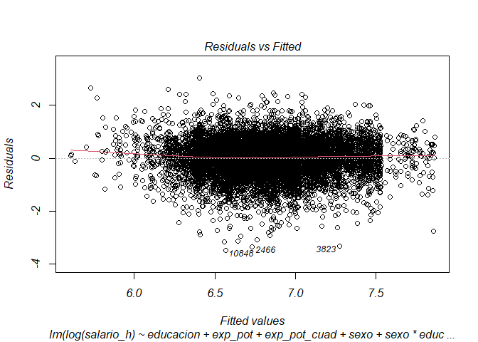<!-- -->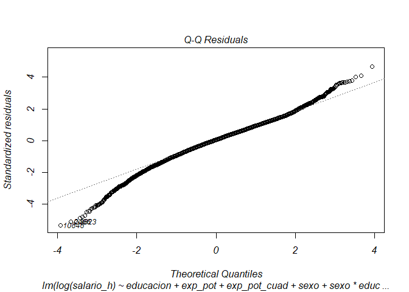<!-- -->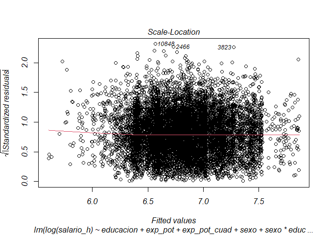<!-- -->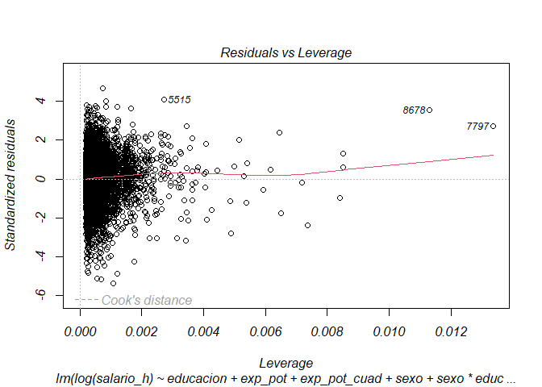<!-- -->

Residuos vs valores predichos Los residuos se distribuyen más
aleatoriamente alrededor del cero que en el modelo anterior, sin
estructura. La variabilidad parece constante alrededor de los predichos,
sugiriendo homocedasticidad. Hay sin embargo algunos valores (10848,
2466, 3823) que parecieran ser outliers

Normal QQ plot: Una mayor propoción de los residuos estandarizados se
ajustan a la curva teórica ~N(0,1).Los puntos en las colas se desvían de
la línea diagonal, lo que sugiere que hay algunos valores atípicos o que
los residuos en estos extremos no siguen completamente una distribución
normal. Los puntos 10848 y 3823 nuevamente aparecen aquí, lo que
confirma que son posibles outliers o influencias fuertes en el modelo.

Residuos estandarizados:Nuevamente no se observan un patrón, aunque hay
varios valores (correspondientes a los mismos de antes)de la raíz del
residuo estandarizado que están más allá del 2, nuevamente, parecieran
corresponder a outliers

Residual vs leverage: Mayoría de los puntos agrupados en torno a bajo
leverage. Aquellos con mayor leverage son de bajo residuo estandarizado.
Los puntos 7797, 8678 y 5515 son los que estaría influenciando demasiado
al modelos

Diagnóstico: este modelo cumple en mayor grado con los supuestos del
modelo lineal en comparación con el modelo anterior, lo cual, teniendo
en cuenta el aumento en el grado de variabilidad del salario horario
explicado lo hace más atractivo. Es importante remarcar sin embargo la
presencia de diversos valores atípicos que debieran ser tratados para
mejorar la eficiencia del modelo.

# 5. Modelos propios y evaluación

Primer modelo propio El modelo mincer demostró que definir la variable
target como una transformación logarítimica del salario horario
contribuye al cumplimiento de lo supuestos. A su vez, fue el que mayor
porcentaje de la varianza de la variable target explicó, por lo tanto lo
usaremos como punto de partida. Resulta intuitivo pensar que el salario
horario no tendrá un comportamiento idéntico a largo del territorio
argentino y según el tipo de establecimiento

``` r
ggplot(df, aes(x = salario_horario, fill = region)) +
  geom_density(alpha = 0.5) +
  labs(title = "Distribución de densidad del salario por región", x = "Salario por hora", y = "Densidad") +
  theme_minimal()+
  facet_wrap(~ region)
```

<!-- -->

``` r
ggplot(df, aes(x = region, y = salario_horario)) +
  geom_boxplot() +
  labs(title = "Distribución de salario por región", x = "Región", y = "Salario por hora") +
  theme_minimal()
```

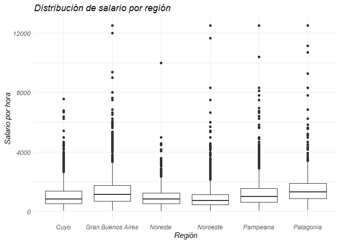<!-- -->

Si bien los gráficos de densidad indican que la distribución del salario
horario sigue la forma característica de un fenomeno económico en todas
las regiones, los boxplot permiten visualizar que regiones como Gran
Buenos Aires, Pampeana y Patagonia parecieran un salario por hora más
alto que el resto

``` r
ggplot(df, aes(x = salario_horario, fill = tipo_establecimiento)) +
  geom_density(alpha = 0.5) +
  labs(title = "Distribución de densidad del salario por región", x = "Salario por hora", y = "Densidad") +
  theme_minimal()
```

<!-- -->

``` r
ggplot(df, aes(x = tipo_establecimiento, y = salario_horario)) +
  geom_boxplot() +
  labs(title = "Distribución de salario por región", x = "Región", y = "Salario por hora") +
  theme_minimal()
```

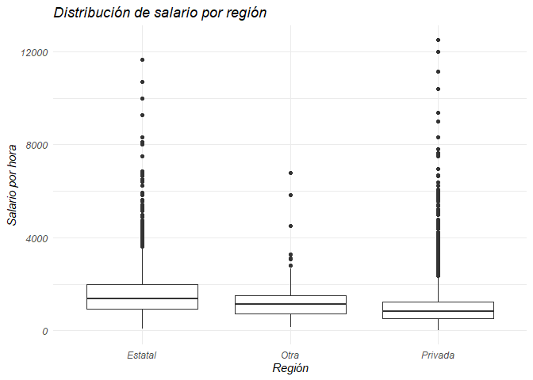<!-- -->

De modo simiar, se aprecian ciertas diferencias en las medidas centrales
de salario horario por tipo de establecimiento, resultado los estatales
los que parecieran tener los valores más altos.

Primer modelo propio: Mincer + región + tipo de etablecimiento $$
  \text{E [ln(SalarioHorario)] = β0 +β1 Años Educacion + β2 Experiencia Potencial + β3 Experiencia Potencial^2+
β4Sexo + β5Sexo · AñosEducacion + β6 Región + β4 Tipo Establecimiento } 
$$

Para un segundo modelo, y de manera más exploratorioa, creamos la
variables años_desde_educación para dar cuenta de hace cuanto las
personas dejaron de estudiar.

``` r
#Nuevas variables

df$anos_desde_educacion <- df$edad - df$educacion

matriz_sp2 <- df [, c("salario_horario", "anos_desde_educacion")]%>% 
  correlate(method = 'spearman') %>% 
  shave() %>% 
  fashion(decimals = 3)
```

    ## Correlation computed with
    ## • Method: 'spearman'
    ## • Missing treated using: 'pairwise.complete.obs'

``` r
matriz_sp2
```

    ##                   term salario_horario anos_desde_educacion
    ## 1      salario_horario                                     
    ## 2 anos_desde_educacion            .049

La misma presenta una correlación positiva leve con la variable target.
A su vez agregaremos la interacción del sexo región y tipo de
establecimiento Segundo modelo propio: Agregamos interacción del sexo y
años_desde_educación

$$
  \text{E [ln(SalarioHorario)] = β0 +β1 Años Educacion + β2 Experiencia Potencial + β3 Experiencia Potencial^2+
β4Sexo + β5Sexo · AñosEducacion + β6 Región + β4 Tipo Establecimiento  + β5Sexo · Región +
β6Sexo · Tipo Establecimiento + β7 Años Desde Educación  } 
$$

``` r
#Agregar al dataset las variables seleccionadas
df_1 <- cbind(df_1, df[, c("region", "tipo_establecimiento", "anos_desde_educacion")])
```

Definimos modelos

``` r
modelo_prop_1 <- lm(log(salario_h) ~ educacion + exp_pot + exp_pot_cuad + sexo + sexo * educacion + region + tipo_establecimiento, data = df_1)
  
modelo_prop_2 <- lm(log(salario_h) ~ educacion + exp_pot + exp_pot_cuad + sexo + sexo * educacion + region + tipo_establecimiento + sexo*region + sexo*tipo_establecimiento + anos_desde_educacion , data = df_1)
```

Evaluación sobre dataset de train y prueba

``` r
#Levanto Test
test <- read.csv("eph_test_2023.csv")
#glimpse(test)

#Analisis Test
exploratorio <- test %>% 
  gather(., key="variables", value = "valores") %>%
  group_by(variables) %>%
  summarise(valores_unicos = n_distinct(valores),
  porcentaje_faltantes = sum(is.na(valores))/nrow(df)*100) %>%
  arrange(desc(porcentaje_faltantes), valores_unicos)
            
#exploratorio # No tiene Nan


#LO hago parecido a train.

#Cambio nombres
test <- test %>%
  rename(exp_pot=experiencia_potencial,
         salario_h=salario_horario)

#calculo exp_pot_cuad
test$exp_pot_cuad <- test$exp_pot^2

#calculo nuevas variables
test$anos_desde_educacion <- test$edad - test$educacion
```

``` r
#Seleccionamos las mismas columnas que en train
test_1 <- test %>%
  select(colnames(df_1))
```

``` r
#METRICAS EN TRAIN

# Predicciones del modelo Mincer en la escala original
predicciones_mincer <- exp(predict(modelo_mincer, newdata=df_1)) 

# Predicciones del modelo múltiple
predicciones_mult <- predict(modelo_mult, newdata=df_1)

# Predicciones del modelo propio 1
predicciones_prop_1 <- exp(predict(modelo_prop_1, newdata=df_1))

# Predicciones del modelo propio 2
predicciones_prop_2 <- exp(predict(modelo_prop_2, newdata=df_1))

# Calcular RMSE
RMSE_mincer <- sqrt(mean((df_1$salario_h - predicciones_mincer)^2))
RMSE_mult <- sqrt(mean((df_1$salario_h - predicciones_mult)^2))
RMSE_prop_1 <- sqrt(mean((df_1$salario_h - predicciones_prop_1)^2))
RMSE_prop_2 <- sqrt(mean((df_1$salario_h - predicciones_prop_2)^2))

# Calcular MAE
MAE_mincer <- mean(abs(df_1$salario_h - predicciones_mincer))
MAE_mult <- mean(abs(df_1$salario_h - predicciones_mult))
MAE_prop_1 <- mean(abs(df_1$salario_h - predicciones_prop_1))
MAE_prop_2 <- mean(abs(df_1$salario_h - predicciones_prop_2))


# Crear un data frame para comparar RMSE y MAE
df_comparacion_metrics <- data.frame(
  modelo = c("modelo_mincer", "modelo_mult", "propio_1", "propio_2"),
  RMSE = c(RMSE_mincer, RMSE_mult, RMSE_prop_1, RMSE_prop_2),
  MAE = c(MAE_mincer, MAE_mult, MAE_prop_1, MAE_prop_2)
)

# Ver el data frame de comparación
df_comparacion_metrics
```

    ##          modelo     RMSE      MAE
    ## 1 modelo_mincer 910.2953 543.3399
    ## 2   modelo_mult 886.3628 570.3081
    ## 3      propio_1 871.8570 506.8868
    ## 4      propio_2 871.4732 506.1217

``` r
# Predicciones del modelo Mincer en la escala original sobre test_1
predicciones_mincer_test <- exp(predict(modelo_mincer, newdata = test_1)) 

# Predicciones del modelo múltiple sobre test_1
predicciones_mult_test <- predict(modelo_mult, newdata = test_1)

# Predicciones del modelo propio 1 sobre test_1
predicciones_prop_1_test <- exp(predict(modelo_prop_1, newdata = test_1))

# Predicciones del modelo propio 2 sobre test_1
predicciones_prop_2_test <- exp(predict(modelo_prop_2, newdata = test_1)) #mejor es el 3, dps quedarse con ese

# Calcular RMSE
RMSE_mincer_test <- sqrt(mean((test_1$salario_h - predicciones_mincer_test)^2))
RMSE_mult_test <- sqrt(mean((test_1$salario_h - predicciones_mult_test)^2))
RMSE_prop_1_test <- sqrt(mean((test_1$salario_h - predicciones_prop_1_test)^2))
RMSE_prop_2_test <- sqrt(mean((test_1$salario_h - predicciones_prop_2_test)^2))

# Calcular MAE
MAE_mincer_test <- mean(abs(test_1$salario_h - predicciones_mincer_test))
MAE_mult_test <- mean(abs(test_1$salario_h - predicciones_mult_test))
MAE_prop_1_test <- mean(abs(test_1$salario_h - predicciones_prop_1_test))
MAE_prop_2_test <- mean(abs(test_1$salario_h - predicciones_prop_2_test))

# Crear un data frame para comparar RMSE y MAE
df_comparacion_metrics_test <- data.frame(
  modelo = c("modelo_mincer", "modelo_mult", "propio_1", "propio_2"),
  RMSE = c(RMSE_mincer_test, RMSE_mult_test, RMSE_prop_1_test, RMSE_prop_2_test),
  MAE = c(MAE_mincer_test, MAE_mult_test, MAE_prop_1_test, MAE_prop_2_test)
)

# Ver el data frame de comparación
df_comparacion_metrics_test
```

    ##          modelo     RMSE      MAE
    ## 1 modelo_mincer 895.3646 532.3231
    ## 2   modelo_mult 872.1339 556.2401
    ## 3      propio_1 848.9217 490.7974
    ## 4      propio_2 846.8062 489.9393

Comparamos

``` r
colnames(df_comparacion_metrics) <- c("modelo", "RMSE_train", "MAE_train")
colnames(df_comparacion_metrics_test) <- c("modelo", "RMSE_test", "MAE_test")

# Unir ambos data frames por el modelo
df_comparacion_total <- left_join(df_comparacion_metrics, df_comparacion_metrics_test, by = "modelo")

# Reordenar las columnas para que RMSE_train y RMSE_test estén lado a lado
df_comparacion_total <- df_comparacion_total %>%
  select(modelo, RMSE_train, RMSE_test, MAE_train, MAE_test)

# Ver el data frame de comparación total
df_comparacion_total
```

    ##          modelo RMSE_train RMSE_test MAE_train MAE_test
    ## 1 modelo_mincer   910.2953  895.3646  543.3399 532.3231
    ## 2   modelo_mult   886.3628  872.1339  570.3081 556.2401
    ## 3      propio_1   871.8570  848.9217  506.8868 490.7974
    ## 4      propio_2   871.4732  846.8062  506.1217 489.9393

Los modelos propios presentan mejores métricas tanto en train como en
test. Curiosamente todos los modelos dan mucho mejor en test que en
train. Teniendo en cuenta que el menor error se obtiene con el modelo
propio_2, este sería el más apropiado para intentar predecir el salario
horario

# 6. Modelo lineal robusto

``` r
#Levanto Outliers
outliers <- read.csv("eph_train_outliers_2023.csv")

outliers <- outliers %>%
  rename(exp_pot=experiencia_potencial, salario_h=salario_horario)
```

``` r
# Crear un dataframe combinado para df_1 y outliers
df_1$dataset <- "df_1"
outliers$dataset <- "outliers"

# Combinar ambos datasets
df_combined <- rbind(df_1[, c("sexo", "salario_h", "dataset")], outliers[, c("sexo", "salario_h", "dataset")])

# Convertir los datasets a formato largo
df_long <- df_combined

# Crear el boxplot
ggplot(df_long, aes(x = sexo, y = salario_h, fill = sexo)) +
  geom_boxplot() +
  facet_wrap(~ dataset, scales = "free") +
  theme_minimal() +
  labs(title = "Boxplot de salario_h por sexo en df_1 y outliers", x = "Sexo", y = "Salario por hora") +
  theme(axis.text.x = element_text(angle = 45, hjust = 1))
```

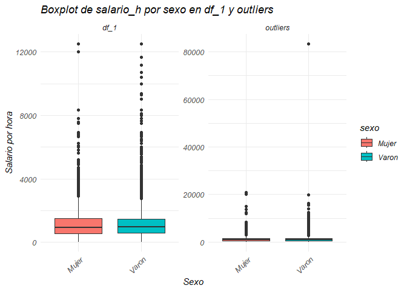<!-- -->

La diferencia de escala y el menor ancho de la caja permite apreciar el
efecto de los outliers en la visualizacion de los datos.

Sobre este nuevo conjunto de datos entrenar el modelo lineal multiple,
el modelo de mincer y un modelo robusto (misma especificación que el
modelo lineal multiple). Comparar exhaustivamente los coeficientes
estimados y su significatividad entre el modelo lineal multiple y el
modelo robusto. Comparar la performance (RMSE y MAE) de los tres modelos
entrenados en este punto en el dataset de entrenamiento (con outliers) y
de evaluación ¿Qué puede concluir al respecto?

``` r
# Cargar la librería robustbase
#install.packages("robustbase")
library(robustbase)
```

    ## 
    ## Adjuntando el paquete: 'robustbase'

    ## The following object is masked from 'package:openintro':
    ## 
    ##     salinity

``` r
outliers$exp_pot_cuad <- outliers$exp_pot^2

# Crear y entrenar el modelo multiple robusto
modelo_mult_robusto <- lmrob(salario_h ~ educacion + exp_pot + exp_pot_cuad + sexo + sexo*educacion, data = outliers)

# Entrenar modelo multiple y de mincer
modelo_mult_out <- lm(salario_h ~ educacion + exp_pot + exp_pot_cuad + sexo + sexo*educacion, data = outliers)
modelo_mincer_out <- lm(log(salario_h) ~ educacion + exp_pot + exp_pot_cuad + sexo + sexo * educacion, data = outliers)
  
# Ver el resumen del modelo robusto
#summary(modelo_mult_robusto)
#summary(modelo_mult_out)
```

``` r
# Resumen de ambos modelos
summary_robusto <- summary(modelo_mult_robusto)
summary_out <- summary(modelo_mult_out)

# Extraer los coeficientes y p-values de ambos modelos
coef_robusto <- summary_robusto$coefficients[, c("Estimate", "Pr(>|t|)")]
coef_out <- summary_out$coefficients[, c("Estimate", "Pr(>|t|)")]


# Crear un dataframe comparativo sin duplicar los nombres de las variables
df_comparacion_coef <- data.frame(
  Estimado_Robusto = coef_robusto[, "Estimate"],
  Estimado_Out = coef_out[, "Estimate"],
  P_value_Robusto = coef_robusto[, "Pr(>|t|)"],
  P_value_Out = coef_out[, "Pr(>|t|)"]
)

# Ver el dataframe comparativo
df_comparacion_coef
```

    ##                     Estimado_Robusto Estimado_Out P_value_Robusto   P_value_Out
    ## (Intercept)             -484.5817041 -899.0123745    7.737587e-34  3.468649e-29
    ## educacion                 87.5763221  123.6644457   3.018432e-203 2.187430e-131
    ## exp_pot                   20.6008518   21.1828906    4.256753e-57  3.244104e-13
    ## exp_pot_cuad              -0.2394063   -0.1261313    1.195362e-21  2.274600e-02
    ## sexoVaron                263.2209190  173.7931098    4.284345e-10  5.130801e-02
    ## educacion:sexoVaron      -13.5759909   -1.0366409    9.569485e-05  8.727568e-01

En el modelo robusto todos los coeficientes resultan significativos, en
tanto que en el múltiple se pierde significancia del parámetro sexo y la
interacción entre sexo y educación. El modelo robusto tiene valores
menores para los coeficientes de los regresores educacion y experiencia
potencial sugiriendo una sobreestimación en estos parametros por parte
del modelo múltiple. En el resto de coeficientes el modelo robusto
presenta valores más elevados en términos absolutos. Dentro de este
grupos están las variables sexo y la interacción educación-sexo, que son
las que son diferencialmente significativas en el modelos robusto En
este modelo, el hecho de ser varón genera, dada la educación y la
experiencia, una diferencia de 263 pesos en el salario horario esperado.
A su vez, dada la experiencia, un año adicional de educación genera
13.57 pesos menos en el salario horario esperado en los variones que en
las mujeres. La diferencia de significatividad en estos coeficientes
sugiere que el modelo multiple estaría siendo incapaz de captar el
efecto del la influencia del sexo y su interacción con la educación
cuando se entrena en un dataset con muchos valores atípicos.

Analizamos R2

``` r
r2_robusto <- summary(modelo_mult_robusto)$r.squared
r2_out <- summary(modelo_mult_out)$r.squared

# Crear un dataframe comparativo para r2
df_comparacion_r2 <- data.frame(
  r2_robusto=r2_robusto,
  r2_out=r2_out
)

df_comparacion_r2
```

    ##   r2_robusto   r2_out
    ## 1  0.2003705 0.103471

A su vez el modelo robusto tiene un mejor R2, implicando una mejor
capacidad explicativa sobre la variabilidad de salario_h

``` r
library(ggplot2)

# Predicciones de los modelos sobre el dataset outliers
predicciones_robusto <- predict(modelo_mult_robusto, newdata = outliers)
predicciones_out <- predict(modelo_mult_out, newdata = outliers)

# Agregar las predicciones al dataframe outliers
outliers$predicciones_robusto <- predicciones_robusto
outliers$predicciones_out <- predicciones_out

# Graficar
ggplot(outliers, aes(x = exp_pot)) +
  geom_point(aes(y = salario_h), color = "black", alpha = 0.5, size = 2) + # Puntos de salario_h reales
  #geom_point(aes(y = predicciones_robusto), color = "blue", alpha = 0.5, size = 2, shape = 21, fill = "lightblue") +
  #geom_point(aes(y = predicciones_out), color = "red", alpha = 0.5, size = 2, shape = 21, fill = "lightpink") +
  geom_smooth(aes(y = predicciones_robusto), method = "loess", color = "blue", se = FALSE) +
  geom_smooth(aes(y = predicciones_out), method = "loess", color = "red", se = FALSE) +
  labs(title = "Predicciones de Modelos en Función de exp_pot",
       x = "Experiencia Potencial (exp_pot)",
       y = "Salario_h") +
  ylim(0, 20000) +
  theme_minimal()
```

    ## `geom_smooth()` using formula = 'y ~ x'

    ## Warning: Removed 3 rows containing non-finite outside the scale range
    ## (`stat_smooth()`).

    ## `geom_smooth()` using formula = 'y ~ x'

    ## Warning: Removed 13 rows containing non-finite outside the scale range
    ## (`stat_smooth()`).

    ## Warning: Removed 2 rows containing missing values or values outside the scale range
    ## (`geom_point()`).

<!-- -->

Métricas en TRAIN

``` r
# Predicciones de los modelos sobre el dataset outliers
predicciones_mult_out <- predict(modelo_mult_out, newdata = outliers)  # Modelo múltiple
predicciones_mult_robusto <- predict(modelo_mult_robusto, newdata = outliers)  # Modelo robusto
predicciones_mincer_out <- exp(predict(modelo_mincer_out, newdata = outliers))  # Modelo Mincer

# Calcular RMSE
RMSE_mult_out_train <- sqrt(mean((outliers$salario_h - predicciones_mult_out)^2))
RMSE_mult_robusto_train <- sqrt(mean((outliers$salario_h - predicciones_mult_robusto)^2))
RMSE_mincer_out_train <- sqrt(mean((outliers$salario_h - predicciones_mincer_out)^2))

# Calcular MAE
MAE_mult_out_train <- mean(abs(outliers$salario_h - predicciones_mult_out))
MAE_mult_robusto_train <- mean(abs(outliers$salario_h - predicciones_mult_robusto))
MAE_mincer_out_train <- mean(abs(outliers$salario_h - predicciones_mincer_out))

# Crear un data frame para comparar RMSE y MAE
df_comparacion_metrics_out_train <- data.frame(
  modelo = c("modelo_mult_out", "modelo_mult_robusto", "modelo_mincer_out"),
  RMSE = c(RMSE_mult_out_train, RMSE_mult_robusto_train, RMSE_mincer_out_train),
  MAE = c(MAE_mult_out_train, MAE_mult_robusto_train, MAE_mincer_out_train)
)

# Ver el data frame de comparación
df_comparacion_metrics_out_train
```

    ##                modelo     RMSE      MAE
    ## 1     modelo_mult_out 1242.741 595.8567
    ## 2 modelo_mult_robusto 1266.005 568.2402
    ## 3   modelo_mincer_out 1264.851 562.7355

``` r
# Predicciones de los modelos sobre el dataset test_1
predicciones_mult_out_test <- predict(modelo_mult_out, newdata = test_1)
predicciones_mult_robusto_test <- predict(modelo_mult_robusto, newdata = test_1)
predicciones_mincer_out_test <- exp(predict(modelo_mincer_out, newdata = test_1))

# Calcular RMSE
RMSE_mult_out_test <- sqrt(mean((test_1$salario_h - predicciones_mult_out_test)^2))
RMSE_mult_robusto_test <- sqrt(mean((test_1$salario_h - predicciones_mult_robusto_test)^2))
RMSE_mincer_out_test <- sqrt(mean((test_1$salario_h - predicciones_mincer_out_test)^2))

# Calcular MAE
MAE_mult_out_test <- mean(abs(test_1$salario_h - predicciones_mult_out_test))
MAE_mult_robusto_test <- mean(abs(test_1$salario_h - predicciones_mult_robusto_test))
MAE_mincer_out_test <- mean(abs(test_1$salario_h - predicciones_mincer_out_test))

# Crear un data frame para comparar RMSE y MAE
df_comparacion_metrics_out_test <- data.frame(
  modelo = c("modelo_mult_out", "modelo_mult_robusto", "modelo_mincer_out"),
  RMSE = c(RMSE_mult_out_test, RMSE_mult_robusto_test, RMSE_mincer_out_test),
  MAE = c(MAE_mult_out_test, MAE_mult_robusto_test, MAE_mincer_out_test)
)

# Ver el data frame de comparación
df_comparacion_metrics_out_test
```

    ##                modelo     RMSE      MAE
    ## 1     modelo_mult_out 873.1666 561.7370
    ## 2 modelo_mult_robusto 895.3467 536.5903
    ## 3   modelo_mincer_out 894.2690 532.0463

``` r
colnames(df_comparacion_metrics_out_train) <- c("modelo", "RMSE_train", "MAE_train")
colnames(df_comparacion_metrics_out_test) <- c("modelo", "RMSE_test", "MAE_test")

# Unir ambos data frames por el modelo
df_comparacion_total_out <- left_join(df_comparacion_metrics_out_train, df_comparacion_metrics_out_test, by = "modelo")

# Reordenar las columnas para que RMSE_train y RMSE_test estén lado a lado
df_comparacion_total_out <- df_comparacion_total_out %>%
  select(modelo, RMSE_train, RMSE_test, MAE_train, MAE_test)

# Ver el data frame de comparación total
df_comparacion_total_out
```

    ##                modelo RMSE_train RMSE_test MAE_train MAE_test
    ## 1     modelo_mult_out   1242.741  873.1666  595.8567 561.7370
    ## 2 modelo_mult_robusto   1266.005  895.3467  568.2402 536.5903
    ## 3   modelo_mincer_out   1264.851  894.2690  562.7355 532.0463

Nuevamente obtengo mejores métricas en test que en train, algo que no
termino de explicar. Curiosamente el modelo robusto no baja el error
cuadratico medio respecto al multiple no robusto, aunque si el error
absoluto. Esto podria explicarse porque esta metrica no penaliza tan
gravemente los errores grandes, al no elevar al cuadrado. Por ultimo, es
interesante notar que el RMSE del multiple no aumenta tanto en este
dataset comparado con el dataset original, indicando que el efecto de
los outliers no es tan grave en esto modelos.
